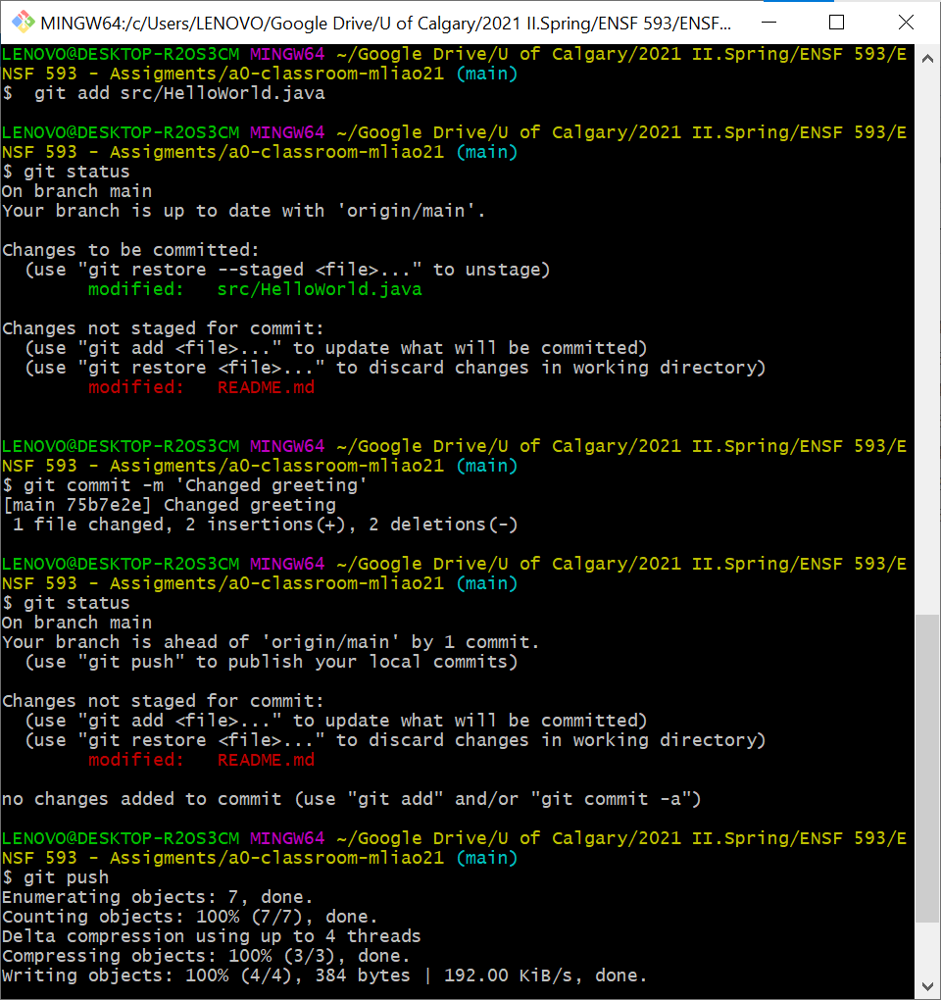

# a0-classroom
A repository to practice github steps.

Author: Melissa Liao

# What to do
1. Clone this repository to your local computer.
2. Change author information in `README.md` and `src/HelloWorld.java` to your first and last name
3. Edit `src/HelloWorld.java` such that the output is changed from 'Hello World!' to 'Hello yourname!', e.g. 'Hello Laura!'. 
4. Verify that the output is correct by running `src/HelloWorld.java`.
5. Add your changes to git with `git add src/HelloWorld.java`, followed by `git commit -m 'Changed greeting'`
6. Create a screenshot of the terminal showing successful execution, save as `screenshot.png` in this directory.
7. Edit `README.md` (this file) and update the _How to run the program_ section to match your program.
8. Commit both modified `README.md` and `screenshot.png` to git.
9. Push local git history to github `git push origin master`

Note that `README.md` is a markdown file. Special syntax takes care of formatting. There are many cheat-sheets online to get you started. [Here is a cheat sheet](https://github.com/adam-p/markdown-here/wiki/Markdown-Cheatsheet)

# How to run the program
You just compile and run the program by clicking the 'play' button. 

I have also successfully changed the greeting of HelloWorld and the author's name. See screenshot below as proof.

